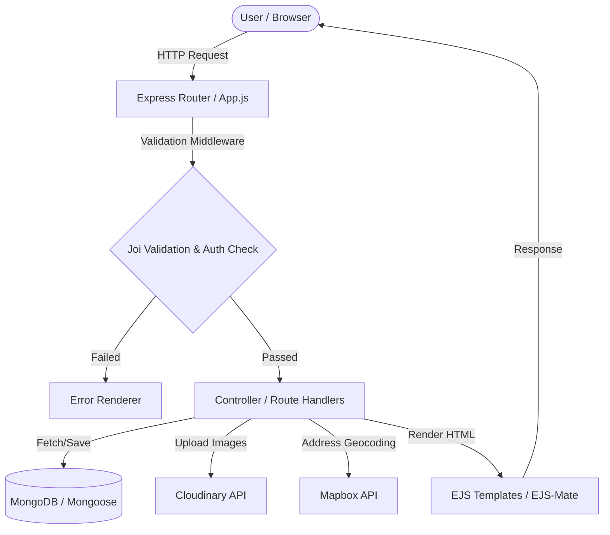

# 🌎 Wanderlust - Full-Stack Travel Listings Platform ✈️

🔗 **Live Demo**: [https://major-project-wht3.onrender.com](https://major-project-wht3.onrender.com)

[](https://nodejs.org/)
[](https://expressjs.com/)
[](https://www.mongodb.com/)
[](https://opensource.org/licenses/ISC)

**Wanderlust** is a feature-rich, full-stack MVC web application designed to browse, list, and review unique properties and homestays around the globe, offering a workflow similar to Airbnb. It integrates cloud-based image hosting, interactive map geocoding, authentication, session validation, and client-side and server-side schemas.

---

## 🏗️ Architecture & Workflow

Here is a visual workflow of how Wanderlust handles requests, user authentication, media storage, maps, and database persistence:



---

## 🚀 Key Features

*   🔒 **Secure Authentication**: Signup, Login, and Logout features with session persistence and custom redirection (remembers previous path) using `passport` and `passport-local`.
*   🏠 **Listings Management (CRUD)**:
    *   Create listing with multi-part forms (titles, descriptions, pricing, locations, and images).
    *   Edit/Update listing details (including uploading new images).
    *   Delete listings (restricted to authorized owners).
*   🗺️ **Interactive Geocoding**: Automatically translates text locations (e.g. "Paris, France") into precise geographic coordinates (Point GeoJSON) and displays them on maps using **Mapbox API**.
*   ☁️ **Cloud Storage**: Seamless image file uploading using `Multer` combined with `Multer-Storage-Cloudinary` to save listing images directly on Cloudinary.
*   💬 **Reviews & Ratings System**: Users can rate properties (1–5 stars) and write comments.
*   🛡️ **Data Validation & Error Management**: Robust backend validation using `Joi` schemas, async safety wrapper `wrapAsync`, and uniform error handling page.

---

## 🛣️ API Reference & Route Directory

Here is the complete catalog of all API routes, request types, required middleware validations, and access controls implemented in Wanderlust:

### 🏠 Listings API

| Method | Endpoint | Description | Middleware / Validation | Access Control |
| :--- | :--- | :--- | :--- | :--- |
| **GET** | `/listings` | Displays the homepage with all listing cards. | None | Public |
| **GET** | `/listings/new` | Renders the form to add a new listing. | `isloggedin` | Registered Users |
| **GET** | `/listings/:id` | Displays comprehensive details, reviews, owner, and map for a specific listing. | None | Public |
| **POST** | `/listings` | Creates a new listing in the database. | `isloggedin`, `upload.single("listing[image]")`, `listingSchema` validation | Registered Users |
| **GET** | `/listings/:id/edit` | Renders the update form containing existing listing details. | `isloggedin` | Authorized Owner |
| **PUT** | `/listings/:id` | Updates an existing listing's information. | `isloggedin` | Authorized Owner |
| **DELETE** | `/listings/:id` | Deletes a listing and its references from the database. | `isloggedin` | Authorized Owner |

### 💬 Reviews API

| Method | Endpoint | Description | Middleware / Validation | Access Control |
| :--- | :--- | :--- | :--- | :--- |
| **POST** | `/listings/:id/reviews` | Adds a new review comment and rating to a listing. | None | Registered Users |
| **DELETE** | `/listings/:id/reviews/:reviewId` | Deletes a specific review and pulls it from listing arrays. | None | Registered Users / Owner |

### 🔑 Authentication & User API

| Method | Endpoint | Description | Middleware / Validation | Access Control |
| :--- | :--- | :--- | :--- | :--- |
| **GET** | `/signup` | Renders the registration/signup page. | None | Public |
| **POST** | `/signup` | Creates a new user profile and logs them in. | Database unique check | Public |
| **GET** | `/login` | Renders the login credential page. | None | Public |
| **POST** | `/login` | Authenticates user login credentials. | `saveRediectUrl`, `passport.authenticate("local")` | Public |
| **GET** | `/logout` | Terminates the user session and flashes a logout notice. | None | Registered Users |
| **GET** | `/demouser` | Test route that registers and sends a fake user payload. | None | Development / Public |

---

## 🗄️ Database Schemas & Models

The MongoDB database relies on three main schemas defined via Mongoose ODM:

### 1. Listing (`models/listning.js`)
Stores all homestay listings with reference keys to `Review` models and owner `User` profiles:
```javascript
{
  title: { type: String, required: true },
  description: String,
  image: {
    url: String,      // Cloudinary URL
    filename: String  // Cloudinary storage identifier
  },
  price: Number,
  location: String,
  country: String,
  review: [{ type: Schema.Types.ObjectId, ref: "Review" }],
  owner: { type: Schema.Types.ObjectId, ref: "User" },
  geometry: {
    type: { type: String, enum: ["Point"], required: true },
    coordinates: { type: [Number], required: true } // [Longitude, Latitude]
  }
}
```

### 2. Review (`models/review.js`)
Maintains reviews left by listing guests:
```javascript
{
  comment: String,
  rating: { type: Number, min: 1, max: 5 },
  createdAt: { type: Date, default: Date.now }
}
```

### 3. User (`models/user.js`)
Uses `passport-local-mongoose` which automatically adds `username`, `hash` (password), and `salt` fields:
```javascript
{
  email: { type: String, required: true }
}
```

---

## ⚙️ Installation & Setup Guide

Follow these steps to run Wanderlust on your local machine:

### 📋 Prerequisites
Make sure you have:
*   [Node.js](https://nodejs.org/) (Version `>= 22.2.0`)
*   [MongoDB Community Server](https://www.mongodb.com/try/download/community) installed and running locally.
*   A [Cloudinary](https://cloudinary.com/) account (for storing uploaded images).
*   A [Mapbox](https://www.mapbox.com/) account (for geocoding addresses and maps).

---

### Step 1: Clone the Project
```bash
git clone https://github.com/HarshitMangal/major_project.git
cd major_project
```

### Step 2: Install Node Packages
```bash
npm install
```

### Step 3: Configure Environment Variables
Create a file named `.env` in the root folder of the project:
```env
CLOUD_NAME=your_cloudinary_cloud_name
CLOUD_API_KEY=your_cloudinary_api_key
CLOUD_API_SECRET=your_cloudinary_api_secret
MAP_TOKEN=your_mapbox_access_token
ATLAS_DB_URL=your_mongodb_atlas_connection_string
SECRET=your_express_session_secret
```

### Step 4: Seed Sample Database Listings
To populate your MongoDB database with preliminary data, run the initialize script:
```bash
node init/index.js
```

### Step 5: Start the Server
Run the startup script:
```bash
npm start
```

Open `http://localhost:7560` on your web browser to access the app!

---

## 📂 Directories Layout

```text
MAJOR_PROJECT/
├── init/                  # DB seed script & mock listings dataset
│   ├── data.js            # Initial listings mock array
│   └── index.js           # Seeding execution script
├── models/                # Mongoose Database Models
│   ├── listning.js        # Listings model
│   ├── review.js          # Ratings & feedback model
│   └── user.js            # User accounts authentication model
├── publlic/               # Public-facing static resources (images, styling sheets, scripts)
├── routes/                # Future modular routes folder
├── utilis/                # Helper utility scripts
│   ├── customerror.js     # Class extension representing custom error statuses
│   └── wrapasync.js       # Express asynchronous middleware wrapper
├── views/                 # MVC View Templates
│   ├── layouts/           # EJS Page layout templates
│   │   └── boilerplate.ejs # Main boilerplate wrapper template
│   ├── listings/          # Templates for CRUD listings (index, show, edit, new)
│   ├── users/             # Login & signup templates
│   └── error.ejs          # Global error display EJS page
├── app.js                 # App configuration & Server initiation file
├── middleware.js          # Authentication and custom middlewares
├── cloudconfig.js         # Cloudinary configuration settings
├── schema.js              # Server-side validation schema constraints using Joi
├── package.json           # Declared dependencies and NPM scripts
└── .env                   # Configuration parameters (ignored by git commits)
```

---

## 📄 License
This application is open-source and released under the [ISC License](LICENSE).
